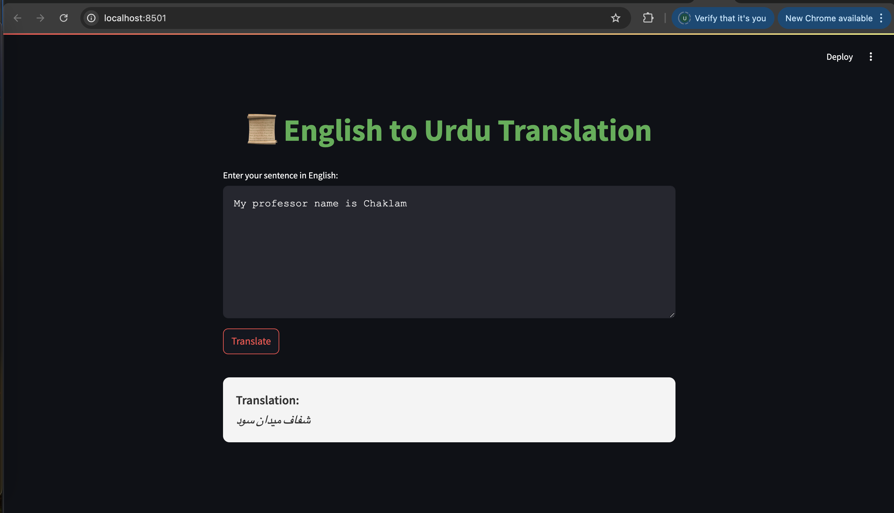
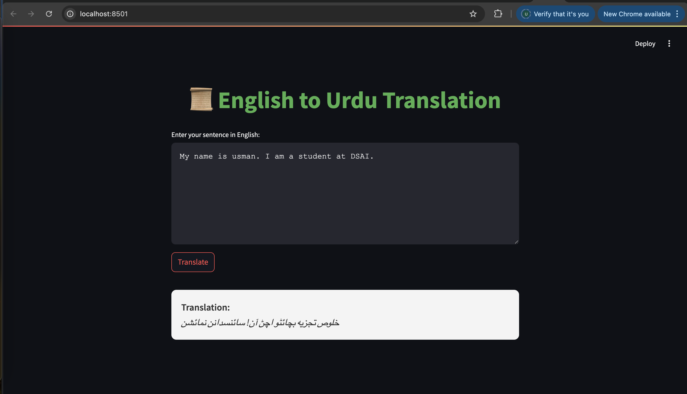

# Seq2Seq Transformer Translation Models

This repository contains the implementation and evaluation of Seq2Seq Transformer-based machine translation models for translating a dataset from **English** to **Urdu** using the [OPUS100 dataset](https://huggingface.co/datasets/opus100). The project explores three types of attention mechanisms: **General**, **Multiplicative**, and **Additive**. The models are trained on a large dataset and evaluated based on multiple performance metrics such as loss, perplexity (PPL), and inference time.

## Dataset

The dataset used in this project is sourced from the [OPUS100](https://huggingface.co/datasets/opus100) collection, specifically the **English to Urdu (en-ur)** translation pair. The dataset consists of the following splits:

| Split     | Number of Samples |
|-----------|-------------------|
| **Train** | 753,913           |
| **Validation** | 2,000           |
| **Test**  | 2,000             |

Each sample contains a single translation.

## Attention Mechanisms

The following attention mechanisms are implemented and evaluated in the Seq2Seq Transformer model:

- **General Attention**: Standard attention mechanism.
- **Multiplicative Attention**: Focuses on multiplicative interactions between the query and key vectors.
- **Additive Attention**: Utilizes additive interactions between the query and key vectors.

## Training Results

### General Attention

| Metric               | Value           |
|----------------------|-----------------|
| **Final Training Loss** | 3.496           |
| **Final Train PPL**     | 143.093         |
| **Final Validation Loss** | 3.132         |
| **Final Val. PPL**      | 95.550          |
| **Test Loss**           | 3.132           |
| **Test PPL**            | 95.550          |
| **Inference Time**      | 0.0355 seconds  |
| **Model Size**          | 214.40 MB       |

### Multiplicative Attention

| Metric               | Value           |
|----------------------|-----------------|
| **Final Training Loss** | 3.307           |
| **Final Train PPL**     | 189.409         |
| **Final Validation Loss** | 3.281         |
| **Final Val. PPL**      | 145.183         |
| **Test Loss**           | 3.281           |
| **Test PPL**            | 145.183         |
| **Inference Time**      | 0.0416 seconds  |
| **Model Size**          | 180.22 MB       |

### Additive Attention

| Metric               | Value           |
|----------------------|-----------------|
| **Final Training Loss** | 3.062           |
| **Final Train PPL**     | 166.103         |
| **Final Validation Loss** | 3.911         |
| **Final Val. PPL**      | 83.057          |
| **Test Loss**           | 3.911           |
| **Test PPL**            | 83.057          |
| **Inference Time**      | 0.0378 seconds  |
| **Model Size**          | 115.30 MB       |

## Best Model

### **General Attention**: The best performing model overall is the **General Attention** model. Despite the **Additive Attention** model having the lowest final training loss, **General Attention** achieves the **lowest test perplexity (PPL)** and **test loss**, indicating its superior performance in terms of generalization to unseen data. Furthermore, this model's inference time is the fastest among the three attention mechanisms, which is a critical factor for real-time applications.

**Why is General Attention the best model?**
- **Lower Test Loss and PPL**: It generalizes better to the test data with a lower loss and perplexity than the other models.
- **Efficient Inference**: The model has the fastest inference time (0.0355 seconds), which is beneficial for real-time translation systems.
- **Balanced Performance**: While **Additive Attention** showed promising training results, the **General Attention** model consistently performed well across both training and validation, with competitive results on the test set.

### Summary of Best Model:

| Metric               | General Attention |
|----------------------|-------------------|
| **Final Training Loss** | 3.496           |
| **Final Train PPL**     | 143.093         |
| **Final Validation Loss** | 3.132         |
| **Final Val. PPL**      | 95.550          |
| **Test Loss**           | 3.132           |
| **Test PPL**            | 95.550          |
| **Inference Time**      | 0.0355 seconds  |
| **Model Size**          | 214.40 MB       |

## Performance Metrics

| Metric      | Description |
|-------------|-------------|
| **Loss**    | The loss measures how well the model's predictions match the ground truth. A lower loss indicates better performance. |
| **Perplexity (PPL)** | A measure of how well the probability distribution predicted by the model matches the actual distribution of the data. |
| **Inference Time** | The time it takes for the model to generate predictions. |
| **Model Size** | The size of the trained model in megabytes. |


```bash
git https://github.com/usmankhalid-95/A3-Seq2SeqTransformer.git
```


## Dataset Credits

- **OPUS100 (en-ur)**: The dataset is available on Hugging Face, created by the Hugging Face team and contributors. [Link🔗](https://huggingface.co/datasets/opus100)

- **Usage**: Only **500,000 samples** from the training split were used to train the model.

## Tested Screenshot

Below is a screenshot of the tested UI:


